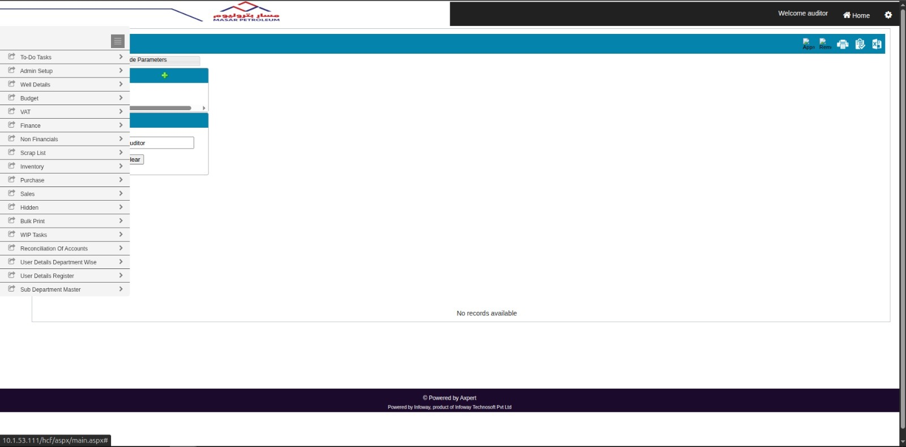
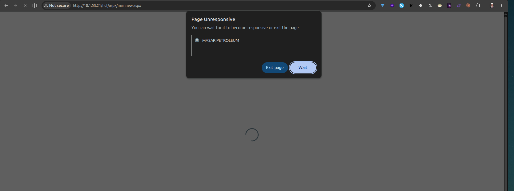
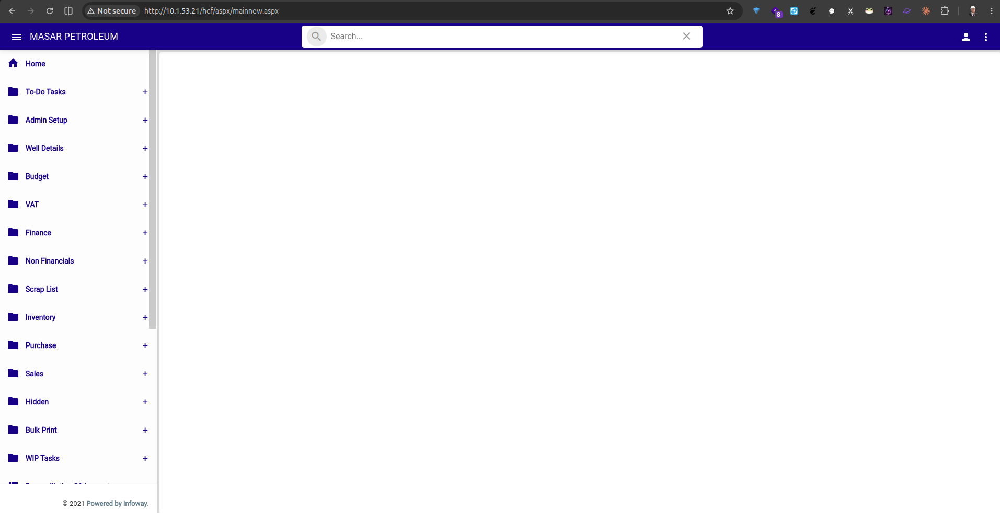
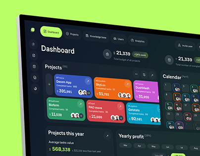
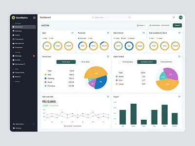
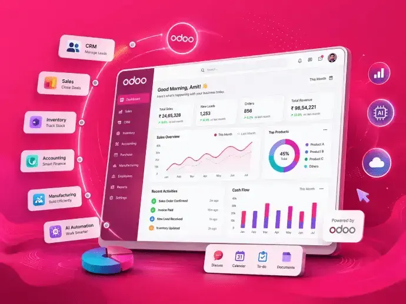
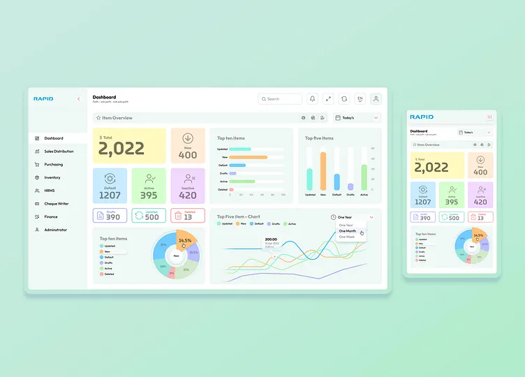
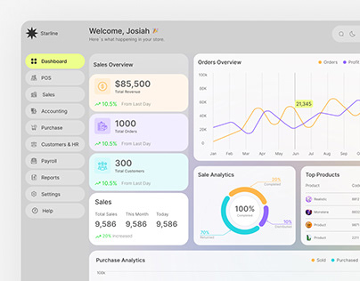
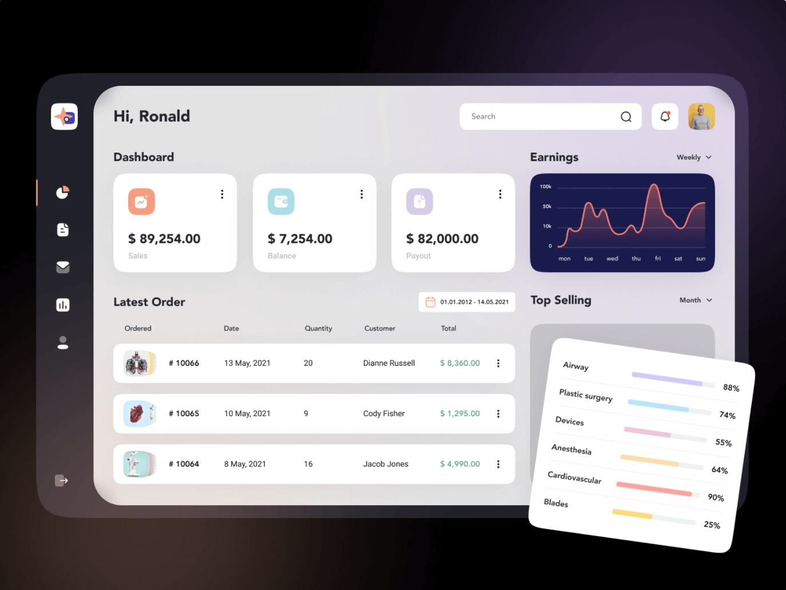
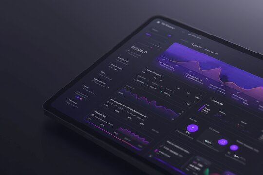

# ERP Technical Assessment Questionnaire

## Masar Petroleum ERP System

### Technical Knowledge Transfer & System Assessment

**Prepared by:** Senior Blockchain LLC
**Consultant:** Milad Raeisi
**Purpose:** ERP Technical Assessment, Knowledge Transfer, and Architecture Review

---

## Confidentiality Notice

This questionnaire is intended solely for the ERP Technical Assessment conducted as part of the Masar Petroleum Digital Transformation initiative.

The information provided will be used exclusively for technical evaluation, knowledge transfer, architecture review, and future ERP planning. All information will be treated as confidential.

---

## Introduction

As part of the ERP Assessment and Digital Transformation engagement, we kindly ask for your support in sharing detailed information about the current ERP system.

The goal of this document is to capture the system's technical architecture, implementation approach, current limitations, and day-to-day operational design.

Please answer each question as clearly and completely as you can. Diagrams, screenshots, documents, or links that support your answers are very welcome.

**How to use this document**

- Each question has a short **Purpose** that explains why we are asking.
- Each question has a suggested **Priority** so the most important topics can be reviewed first.
- Please write your answer in the **Response** field and update the **Status** for each question.
- If a question does not apply, please mark **Not Applicable** and add a short reason.
- If you are not sure, an honest estimate is better than leaving it blank.

**Priority guide:** Critical = review first, High = important, Medium = useful, Low = optional.

---

# Section 1 - System Architecture & Technology

## 1. Overall System Architecture

**Priority:** ☑ Critical &nbsp; ☐ High &nbsp; ☐ Medium &nbsp; ☐ Low

**Question**
Please describe the overall ERP system architecture, including all major components and how they connect and communicate with each other.

**Purpose**
To understand the high-level design, the main building blocks, and how the system fits together.

**Status:** ☐ Completed &nbsp; ☐ Pending &nbsp; ☐ Not Applicable

**Response**

---

## 2. Technology Stack

**Priority:** ☑ Critical &nbsp; ☐ High &nbsp; ☐ Medium &nbsp; ☐ Low

**Question**
Please list the complete technology stack, including programming languages, frameworks, databases, third-party components, and development tools. Please also include version numbers.

**Purpose**
To understand all the technologies the solution depends on and whether any are outdated.

**Status:** ☐ Completed &nbsp; ☐ Pending &nbsp; ☐ Not Applicable

**Response**

---

## 3. Application Architecture & Business Logic

**Priority:** ☑ Critical &nbsp; ☐ High &nbsp; ☐ Medium &nbsp; ☐ Low

**Question**
Please explain how the application is layered (Presentation, Business, and Data layers) and where the business logic actually runs. Which business rules are configurable through settings, and which are hard-coded in the application or database?

**Purpose**
To understand how responsibilities are divided and how much effort future changes will require.

**Status:** ☐ Completed &nbsp; ☐ Pending &nbsp; ☐ Not Applicable

**Response**

---

## 4. Desktop & Web ERP Relationship

**Priority:** ☐ Critical &nbsp; ☑ High &nbsp; ☐ Medium &nbsp; ☐ Low

**Question**
Please explain the relationship between the Desktop ERP and the Web ERP. Do both share the same database and the same business logic, or are they separate?

**Purpose**
To understand how the two platforms work together and stay consistent.

**Status:** ☐ Completed &nbsp; ☐ Pending &nbsp; ☐ Not Applicable

**Response**

---

## 5. Axpert Platform & Customizations

**Priority:** ☑ Critical &nbsp; ☐ High &nbsp; ☐ Medium &nbsp; ☐ Low

**Question**
Please explain the role of the Axpert platform in the solution. Which parts are standard Axpert features, and which parts were custom-built or heavily customized for this project?

**Purpose**
To understand how much the system depends on the platform and how large the customization scope is.

**Status:** ☐ Completed &nbsp; ☐ Pending &nbsp; ☐ Not Applicable

**Response**

---

# Section 2 - Database & Data

## 6. Database Architecture & Standards

**Priority:** ☑ Critical &nbsp; ☐ High &nbsp; ☐ Medium &nbsp; ☐ Low

**Question**
Please describe the database architecture, including the database engine and version, schema organization, and the main design standards used (naming conventions, indexing strategy, constraints, and normalization level).

**Purpose**
To understand the database structure and the overall quality and consistency of its design.

**Status:** ☐ Completed &nbsp; ☐ Pending &nbsp; ☐ Not Applicable

**Response**

---

## 7. Database Business Logic

**Priority:** ☐ Critical &nbsp; ☑ High &nbsp; ☐ Medium &nbsp; ☐ Low

**Question**
Please describe the business logic that runs inside the database, such as stored procedures, functions, triggers, packages, and views. Roughly how much of the core logic lives in the database?

**Purpose**
To understand where critical business rules are executed and how maintainable they are.

**Status:** ☐ Completed &nbsp; ☐ Pending &nbsp; ☐ Not Applicable

**Response**

---

## 8. Transaction & Concurrency Control

**Priority:** ☐ Critical &nbsp; ☑ High &nbsp; ☐ Medium &nbsp; ☐ Low

**Question**
Please explain how the system handles database transactions and how it keeps data consistent if a multi-step process fails partway through. How does it handle several users editing the same record at the same time?

**Purpose**
To evaluate data integrity, rollback behavior, and concurrency handling.

**Status:** ☐ Completed &nbsp; ☐ Pending &nbsp; ☐ Not Applicable

**Response**

---

## 9. Data Validation & Data Quality

**Priority:** ☐ Critical &nbsp; ☑ High &nbsp; ☐ Medium &nbsp; ☐ Low

**Question**
Please explain how input data is checked before it is saved. Are there any known issues with data integrity, consistency, duplicates, or reconciliation today?

**Purpose**
To understand data quality controls and the reliability of the data.

**Status:** ☐ Completed &nbsp; ☐ Pending &nbsp; ☐ Not Applicable

**Response**

---

## 10. Master Data Management

**Priority:** ☐ Critical &nbsp; ☑ High &nbsp; ☐ Medium &nbsp; ☐ Low

**Question**
Please describe how master data is structured and controlled (for example: Chart of Accounts, AFE, Budget, Activity Codes, Items, Vendors, and Employees).

**Purpose**
To understand how core business data is organized and governed.

**Status:** ☐ Completed &nbsp; ☐ Pending &nbsp; ☐ Not Applicable

**Response**

---

## 11. Data Volumes & System Sizing

**Priority:** ☐ Critical &nbsp; ☑ High &nbsp; ☐ Medium &nbsp; ☐ Low

**Question**
Please share the current size of the system: approximate database size, the number of records in the largest tables, the average daily transaction volume, and the number of active and concurrent users.

**Purpose**
To understand the real scale of the system and plan for performance and growth.

**Status:** ☐ Completed &nbsp; ☐ Pending &nbsp; ☐ Not Applicable

**Response**

---

## 12. Data Migration History

**Priority:** ☐ Critical &nbsp; ☐ High &nbsp; ☑ Medium &nbsp; ☐ Low

**Question**
Please describe the major data migration activities completed since the project began. What problems came up, and how was the data checked for correctness afterwards?

**Purpose**
To understand past migration quality and any remaining data risks.

**Status:** ☐ Completed &nbsp; ☐ Pending &nbsp; ☐ Not Applicable

**Response**

---

## 13. Production Data Correction Process

**Priority:** ☐ Critical &nbsp; ☑ High &nbsp; ☐ Medium &nbsp; ☐ Low

**Question**
When a data problem happens in production, how is it fixed? Are corrections made through the application, or by changing the database directly? Please describe the full process and who approves it.

**Purpose**
To assess data governance, traceability, and operational risk.

**Status:** ☐ Completed &nbsp; ☐ Pending &nbsp; ☐ Not Applicable

**Response**

---

## 14. Database Maintenance

**Priority:** ☐ Critical &nbsp; ☐ High &nbsp; ☑ Medium &nbsp; ☐ Low

**Question**
Please describe routine database maintenance, such as index rebuilding, statistics updates, optimization, and health checks. How often are these done?

**Purpose**
To understand how the database is kept healthy over time.

**Status:** ☐ Completed &nbsp; ☐ Pending &nbsp; ☐ Not Applicable

**Response**

---

# Section 3 - Functional Modules & Features

## 15. ERP Modules & Status

**Priority:** ☑ Critical &nbsp; ☐ High &nbsp; ☐ Medium &nbsp; ☐ Low

**Question**
Please list all ERP modules and mark each one as completed, partially implemented, or still under development.

**Purpose**
To understand the current implementation status across the whole system.

**Status:** ☐ Completed &nbsp; ☐ Pending &nbsp; ☐ Not Applicable

**Response**

---

## 16. Business Process Coverage

**Priority:** ☑ Critical &nbsp; ☐ High &nbsp; ☐ Medium &nbsp; ☐ Low

**Question**
Please describe which business processes are currently fully supported by the ERP, which are partially supported, and which are still performed manually outside the ERP (using Excel, email, paper forms, or other systems). If available, please indicate the primary department responsible for each process.

**Purpose**
To understand the actual ERP adoption level, identify business processes that remain outside the system, and assess opportunities for future process automation.

**Status:** ☐ Completed &nbsp; ☐ Pending &nbsp; ☐ Not Applicable

**Response**

---

## 17. Workflow Engine

**Priority:** ☐ Critical &nbsp; ☑ High &nbsp; ☐ Medium &nbsp; ☐ Low

**Question**
Please explain how workflows are designed, configured, and maintained. Can workflows be changed through configuration, or do they require software development?

**Purpose**
To understand how flexible the workflow system is.

**Status:** ☐ Completed &nbsp; ☐ Pending &nbsp; ☐ Not Applicable

**Response**

---

## 18. Notifications

**Priority:** ☐ Critical &nbsp; ☐ High &nbsp; ☐ Medium &nbsp; ☑ Low

**Question**
Please explain how notifications are created and delivered (for example: email, SMS, in-app alerts, or workflow alerts).

**Purpose**
To understand how the system communicates with users.

**Status:** ☐ Completed &nbsp; ☐ Pending &nbsp; ☐ Not Applicable

**Response**

---

## 19. Reporting

**Priority:** ☐ Critical &nbsp; ☑ High &nbsp; ☐ Medium &nbsp; ☐ Low

**Question**
Please explain how reports are built, customized, scheduled, and maintained. Which reports currently have performance problems?

**Purpose**
To understand reporting capabilities and known limitations.

**Status:** ☐ Completed &nbsp; ☐ Pending &nbsp; ☐ Not Applicable

**Response**

---

## 20. Document Management

**Priority:** ☐ Critical &nbsp; ☐ High &nbsp; ☑ Medium &nbsp; ☐ Low

**Question**
Please explain how documents and attachments are stored, indexed, secured, versioned, and backed up within the ERP.

**Purpose**
To evaluate document handling capabilities.

**Status:** ☐ Completed &nbsp; ☐ Pending &nbsp; ☐ Not Applicable

**Response**

---

## 21. Localization & Multi-Currency

**Priority:** ☐ Critical &nbsp; ☐ High &nbsp; ☑ Medium &nbsp; ☐ Low

**Question**
Please explain how the system handles multiple languages, multiple currencies, date and time zones, and any region-specific formatting or tax rules.

**Purpose**
To understand the system's readiness for different languages, currencies, and regions.

**Status:** ☐ Completed &nbsp; ☐ Pending &nbsp; ☐ Not Applicable

**Response**

---

## 22. Mobile & Remote Access

**Priority:** ☐ Critical &nbsp; ☐ High &nbsp; ☐ Medium &nbsp; ☑ Low

**Question**
Can users access the ERP from mobile devices or from outside the office? Please explain what is supported and any security or performance limits.

**Purpose**
To understand mobile and remote access capabilities.

**Status:** ☐ Completed &nbsp; ☐ Pending &nbsp; ☐ Not Applicable

**Response**

---

## 23. Known Functional Limitations

**Priority:** ☐ Critical &nbsp; ☑ High &nbsp; ☐ Medium &nbsp; ☐ Low

**Question**
Please describe the current functional limitations or unfinished areas. Which business requirements cannot be supported today?

**Purpose**
To identify functional gaps that may affect future work.

**Status:** ☐ Completed &nbsp; ☐ Pending &nbsp; ☐ Not Applicable

**Response**

---

# Section 4 - Security & Access

## 24. User & Access Management

**Priority:** ☑ Critical &nbsp; ☐ High &nbsp; ☐ Medium &nbsp; ☐ Low

**Question**
Please explain how users, roles, permissions, and access rights are managed in the ERP.

**Purpose**
To assess the access control model.

**Status:** ☐ Completed &nbsp; ☐ Pending &nbsp; ☐ Not Applicable

**Response**

---

## 25. Security Architecture

**Priority:** ☑ Critical &nbsp; ☐ High &nbsp; ☐ Medium &nbsp; ☐ Low

**Question**
Please describe the security design, including authentication, authorization, password policies, encryption (in transit and at rest), and other security controls.

**Purpose**
To evaluate the overall security posture.

**Status:** ☐ Completed &nbsp; ☐ Pending &nbsp; ☐ Not Applicable

**Response**

---

## 26. Audit Trail & Logging

**Priority:** ☐ Critical &nbsp; ☑ High &nbsp; ☐ Medium &nbsp; ☐ Low

**Question**
Please explain how the system records user activity, data changes, approvals, and key events. Where are these logs stored, and which operations are fully auditable?

**Purpose**
To assess traceability, accountability, and troubleshooting ability.

**Status:** ☐ Completed &nbsp; ☐ Pending &nbsp; ☐ Not Applicable

**Response**

---

## 27. Compliance & Regulatory Requirements

**Priority:** ☐ Critical &nbsp; ☑ High &nbsp; ☐ Medium &nbsp; ☐ Low

**Question**
Please describe any compliance, regulatory, or industry standards the ERP must meet (for example: financial reporting, petroleum industry rules, or data protection). How does the system support these?

**Purpose**
To understand compliance obligations and how well the system meets them.

**Status:** ☐ Completed &nbsp; ☐ Pending &nbsp; ☐ Not Applicable

**Response**

---

# Section 5 - Integration

## 28. Integration Architecture

**Priority:** ☐ Critical &nbsp; ☑ High &nbsp; ☐ Medium &nbsp; ☐ Low

**Question**
Please list all systems integrated with the ERP and explain how each integration works (for example: API, direct database, file exchange, or web services).

**Purpose**
To understand external system dependencies and how data moves between them.

**Status:** ☐ Completed &nbsp; ☐ Pending &nbsp; ☐ Not Applicable

**Response**

---

## 29. API Availability

**Priority:** ☐ Critical &nbsp; ☑ High &nbsp; ☐ Medium &nbsp; ☐ Low

**Question**
Please describe all available APIs and integration services, including their purpose, format, and documentation status.

**Purpose**
To evaluate the system's integration capabilities.

**Status:** ☐ Completed &nbsp; ☐ Pending &nbsp; ☐ Not Applicable

**Response**

---

## 30. External Dependencies & Scheduled Jobs

**Priority:** ☐ Critical &nbsp; ☐ High &nbsp; ☑ Medium &nbsp; ☐ Low

**Question**
Please list all external systems, services, scheduled jobs, batch processes, and background tasks that the ERP needs in order to run normally.

**Purpose**
To understand operational dependencies and automated processes.

**Status:** ☐ Completed &nbsp; ☐ Pending &nbsp; ☐ Not Applicable

**Response**

---

# Section 6 - Infrastructure & Operations

## 31. Production Infrastructure

**Priority:** ☐ Critical &nbsp; ☑ High &nbsp; ☐ Medium &nbsp; ☐ Low

**Question**
Please describe the production infrastructure, including servers, web server (IIS) configuration, and overall deployment layout.

**Purpose**
To understand how the system is deployed and hosted.

**Status:** ☐ Completed &nbsp; ☐ Pending &nbsp; ☐ Not Applicable

**Response**

---

## 32. Environment Management

**Priority:** ☐ Critical &nbsp; ☐ High &nbsp; ☑ Medium &nbsp; ☐ Low

**Question**
Please describe the available environments (Development, Test, UAT, Production) and explain how configuration and data are kept in sync between them.

**Purpose**
To understand how changes are tested before reaching production.

**Status:** ☐ Completed &nbsp; ☐ Pending &nbsp; ☐ Not Applicable

**Response**

---

## 33. System Availability & Monitoring

**Priority:** ☐ Critical &nbsp; ☑ High &nbsp; ☐ Medium &nbsp; ☐ Low

**Question**
What is the expected uptime, and how are application health, errors, performance, and server resources monitored? Which tools are used?

**Purpose**
To understand operational reliability and monitoring maturity.

**Status:** ☐ Completed &nbsp; ☐ Pending &nbsp; ☐ Not Applicable

**Response**

---

## 34. Performance & Stability

**Priority:** ☑ Critical &nbsp; ☐ High &nbsp; ☐ Medium &nbsp; ☐ Low

**Question**
Please identify the main performance and stability problems affecting the ERP today (for example: slow pages, freezes, or "page unresponsive" messages) and explain their root causes. What has been done or is planned to fix them?

**Purpose**
To understand current bottlenecks, their causes, and the plan to resolve them.

**Status:** ☐ Completed &nbsp; ☐ Pending &nbsp; ☐ Not Applicable

**Response**

---

## 35. Scalability & Capacity Planning

**Priority:** ☐ Critical &nbsp; ☑ High &nbsp; ☐ Medium &nbsp; ☐ Low

**Question**
Can the current architecture support future growth in users, business units, and modules? How do you estimate future needs for storage, CPU, memory, and database growth?

**Purpose**
To assess long-term scalability and infrastructure planning.

**Status:** ☐ Completed &nbsp; ☐ Pending &nbsp; ☐ Not Applicable

**Response**

---

## 36. Backup, Disaster Recovery & Business Continuity

**Priority:** ☑ Critical &nbsp; ☐ High &nbsp; ☐ Medium &nbsp; ☐ Low

**Question**
Please explain the backup policy, how backups are tested and restored, and the disaster recovery strategy, including Recovery Time Objective (RTO) and Recovery Point Objective (RPO).

**Purpose**
To evaluate data safety and business continuity readiness.

**Status:** ☐ Completed &nbsp; ☐ Pending &nbsp; ☐ Not Applicable

**Response**

---

# Section 7 - Engineering & Governance

## 37. Source Code Ownership

**Priority:** ☑ Critical &nbsp; ☐ High &nbsp; ☐ Medium &nbsp; ☐ Low

**Question**
Please clarify who owns the source code. Is the complete source code available? Are there any third-party components or modules where the source code is not available?

**Purpose**
To understand maintenance limits and long-term ownership.

**Status:** ☐ Completed &nbsp; ☐ Pending &nbsp; ☐ Not Applicable

**Response**

---

## 38. Development Process & Code Standards

**Priority:** ☐ Critical &nbsp; ☑ High &nbsp; ☐ Medium &nbsp; ☐ Low

**Question**
Please explain your development lifecycle, version control strategy, testing process, and the coding standards, design patterns, and guidelines the team follows.

**Purpose**
To understand software engineering practices and code quality.

**Status:** ☐ Completed &nbsp; ☐ Pending &nbsp; ☐ Not Applicable

**Response**

---

## 39. Change Management & Release Management

**Priority:** ☐ Critical &nbsp; ☑ High &nbsp; ☐ Medium &nbsp; ☐ Low

**Question**
Please explain the full process for a change request, from analysis and development through testing, approval, deployment, and production release.

**Purpose**
To understand how changes are controlled and governed.

**Status:** ☐ Completed &nbsp; ☐ Pending &nbsp; ☐ Not Applicable

**Response**

---

## 40. Error & Issue Management

**Priority:** ☐ Critical &nbsp; ☑ High &nbsp; ☐ Medium &nbsp; ☐ Low

**Question**
How are errors and issues found, reported, prioritized, tracked, and resolved? What are the most common errors today, and what is the long-term plan to reduce them and improve quality?

**Purpose**
To evaluate support processes and the maturity of the implementation.

**Status:** ☐ Completed &nbsp; ☐ Pending &nbsp; ☐ Not Applicable

**Response**

---

## 41. Upgrade Strategy

**Priority:** ☐ Critical &nbsp; ☐ High &nbsp; ☑ Medium &nbsp; ☐ Low

**Question**
Please explain how upgrades are performed and how customizations are protected and maintained during an upgrade.

**Purpose**
To assess future maintainability.

**Status:** ☐ Completed &nbsp; ☐ Pending &nbsp; ☐ Not Applicable

**Response**

---

## 42. Dependencies, Licensing & Vendor Lock-in

**Priority:** ☑ Critical &nbsp; ☐ High &nbsp; ☐ Medium &nbsp; ☐ Low

**Question**
Please list all critical dependencies and required licenses (for example: Axpert, Oracle, and third-party libraries), including their cost impact. Which parts of the ERP cannot be changed without Infoway Technologies or another vendor?

**Purpose**
To understand operational costs, licensing constraints, and vendor lock-in risks.

**Status:** ☐ Completed &nbsp; ☐ Pending &nbsp; ☐ Not Applicable

**Response**

---

## 43. Documentation

**Priority:** ☐ Critical &nbsp; ☑ High &nbsp; ☐ Medium &nbsp; ☐ Low

**Question**
Please list all available technical documentation (Architecture, Database, API, Deployment, User Manuals, Workflow, ERD, and so on). Which important documents are missing, incomplete, or out of date?

**Purpose**
To assess documentation completeness and identify gaps.

**Status:** ☐ Completed &nbsp; ☐ Pending &nbsp; ☐ Not Applicable

**Response**

---

# Section 8 - User Experience

## 44. User Experience (UX) & User Interface (UI)

**Priority:** ☐ Critical &nbsp; ☐ High &nbsp; ☑ Medium &nbsp; ☐ Low

**Question**
Please explain the design thinking behind the current interface. Have any usability studies or user feedback sessions been done? If so, what were the findings and any planned improvements?

**Purpose**
To understand usability and find ways to improve user productivity and satisfaction.

**Status:** ☐ Completed &nbsp; ☐ Pending &nbsp; ☐ Not Applicable

**Response**

---

# Section 9 - Assessment, Risks & Recommendations

## 45. Current Technical Challenges & Technical Debt

**Priority:** ☑ Critical &nbsp; ☐ High &nbsp; ☐ Medium &nbsp; ☐ Low

**Question**
Please identify the most significant technical issues and technical debt in the system today. Which parts would you redesign if you could, and why?

**Purpose**
To understand existing technical debt and architectural weaknesses.

**Status:** ☐ Completed &nbsp; ☐ Pending &nbsp; ☐ Not Applicable

**Response**

---

## 46. Top Technical Risks

**Priority:** ☑ Critical &nbsp; ☐ High &nbsp; ☐ Medium &nbsp; ☐ Low

**Question**
What are the top technical, operational, and architectural risks that management should know about regarding the current ERP system?

**Purpose**
To surface hidden risks from the implementation team's point of view.

**Status:** ☐ Completed &nbsp; ☐ Pending &nbsp; ☐ Not Applicable

**Response**

---

## 47. Architecture Suitability for Future Growth

**Priority:** ☐ Critical &nbsp; ☑ High &nbsp; ☐ Medium &nbsp; ☐ Low

**Question**
Considering current business needs and future digital transformation goals, is the existing architecture still suitable for the long term? If not, which parts should be redesigned or modernized?

**Purpose**
To understand whether the current architecture can support the future, or whether major modernization is needed.

**Status:** ☐ Completed &nbsp; ☐ Pending &nbsp; ☐ Not Applicable

**Response**

---

## 48. ERP Readiness Self-Assessment

**Priority:** ☐ Critical &nbsp; ☑ High &nbsp; ☐ Medium &nbsp; ☐ Low

**Question**
On a scale of **1 to 10**, how would you rate the current ERP in each area below? Please give a short reason for each rating.

- Architecture
- Security
- Performance
- Scalability
- Maintainability
- Documentation
- Code Quality
- Database Design
- User Experience
- Overall ERP Readiness

**Purpose**
To capture the team's own view of the system's maturity and find priority areas for improvement.

**Status:** ☐ Completed &nbsp; ☐ Pending &nbsp; ☐ Not Applicable

**Response**

---

## 49. Knowledge Dependency & Key-Person Risk

**Priority:** ☐ Critical &nbsp; ☑ High &nbsp; ☐ Medium &nbsp; ☐ Low

**Question**
Are there parts of the ERP that depend on specific developers or key individuals? Please identify areas where knowledge is not well documented.

**Purpose**
To assess key-person risk and knowledge transfer needs.

**Status:** ☐ Completed &nbsp; ☐ Pending &nbsp; ☐ Not Applicable

**Response**

---

## 50. Recommendations

**Priority:** ☐ Critical &nbsp; ☑ High &nbsp; ☐ Medium &nbsp; ☐ Low

**Question**
Based on your experience, what are your top recommendations to improve the system's architecture, performance, security, maintainability, and overall business value?

**Purpose**
To capture expert recommendations directly from the implementation team.

**Status:** ☐ Completed &nbsp; ☐ Pending &nbsp; ☐ Not Applicable

**Response**

---

## 51. Roadmap

**Priority:** ☐ Critical &nbsp; ☐ High &nbsp; ☑ Medium &nbsp; ☐ Low

**Question**
Please describe the current ERP roadmap, planned enhancements, and upcoming milestones.

**Purpose**
To understand the planned future direction.

**Status:** ☐ Completed &nbsp; ☐ Pending &nbsp; ☐ Not Applicable

**Response**

---

## 52. Technical Lessons Learned

**Priority:** ☐ Critical &nbsp; ☐ High &nbsp; ☑ Medium &nbsp; ☐ Low

**Question**
After years of building and supporting this ERP, what are the most important technical lessons learned? If you started again today, what would you do differently?

**Purpose**
To capture valuable experience that can guide future modernization.

**Status:** ☐ Completed &nbsp; ☐ Pending &nbsp; ☐ Not Applicable

**Response**

---

## 53. Executive Technical Summary

**Priority:** ☐ Critical &nbsp; ☑ High &nbsp; ☐ Medium &nbsp; ☐ Low

**Question**
If you had only ten minutes to brief a new ERP Technical Architect joining this project, what key facts, design decisions, limitations, and risks must they understand before working on the system?

**Purpose**
To capture the most important knowledge that may not exist in formal documents.

**Status:** ☐ Completed &nbsp; ☐ Pending &nbsp; ☐ Not Applicable

**Response**

---

## 54. Additional Information

**Priority:** ☐ Critical &nbsp; ☐ High &nbsp; ☐ Medium &nbsp; ☑ Low

**Question**
Please share any other technical information, concerns, recommendations, or documents that would help us better understand the ERP system.

**Purpose**
To capture anything important not covered above.

**Status:** ☐ Completed &nbsp; ☐ Pending &nbsp; ☐ Not Applicable

**Response**

---

## 55. Strategic Justification - Continuing with the Current ERP

**Priority:** ☑ Critical &nbsp; ☐ High &nbsp; ☐ Medium &nbsp; ☐ Low

The screenshots below are provided for context. The first group shows the **current ERP system**, and the second group shows examples of **modern ERP platforms** for comparison.

**Current ERP System**

<table>
  <tr>
    <td align="center"> Current ERP - Screen 1</td>
    <td align="center"> Current ERP - Screen 2</td>
    <td align="center"> Current ERP - Screen 3</td>
  </tr>
</table>

**Modern ERP Systems (Reference)**

<table>
  <tr>
    <td align="center"> Modern ERP - Example 1</td>
    <td align="center"> Modern ERP - Example 2</td>
    <td align="center"> Modern ERP - Example 3</td>
  </tr>
  <tr>
    <td align="center"> Modern ERP - Example 4</td>
    <td align="center"> Modern ERP - Example 5</td>
    <td align="center"> Modern ERP - Example 6</td>
  </tr>
  <tr>
    <td align="center"> Modern ERP - Example 7</td>
    <td></td>
    <td></td>
  </tr>
</table>

**Question**
After more than ten years of continuous development and support, the current ERP system still shows a large number of errors, bugs, and usability issues, as reflected in the screenshots above. Compared with modern ERP platforms, what is the clear technical and business justification for the company to keep investing in and operating the current system instead of modernizing or replacing it?

Please explain your reasoning from four perspectives:

- **Architecture and technology** - Can the current platform realistically meet future needs?
- **Cost** - Total cost of continuing (licenses, maintenance, fixes, lost productivity) versus modernization.
- **Risk** - Operational, security, and key-person risks of staying on the current system.
- **Long-term value** - How does continuing serve the company's digital transformation goals?

**Purpose**
To capture an honest, evidence-based justification for continuing with the current ERP, and to support a fair decision between further investment in the existing system and modernization or replacement.

**Status:** ☐ Completed &nbsp; ☐ Pending &nbsp; ☐ Not Applicable

**Response**

---

# Requested Supporting Documents

If available, please share the following documents. If something does not exist, please simply note that.

**Architecture & Design**

- Solution / System Architecture Document
- Software Architecture Diagram
- Infrastructure Diagram
- Network Diagram

**Database**

- Database ER Diagram (ERD)
- Database Schema
- Data Dictionary
- Database Size Report

**Application & Code**

- Source Code Structure
- API Documentation (Swagger / Postman)
- Module List
- Workflow Configuration
- Master Data Documentation
- Integration Architecture

**Deployment & Operations**

- Deployment Guide
- Installation Guide
- Configuration Guide
- Server Specifications
- Backup & Disaster Recovery Procedures
- Production Support Guide
- Performance Reports

**Quality & Governance**

- Release Notes / Change Log
- Known Issues Register / Bug Tracker Export
- Test Cases / UAT Documents
- User & Role Matrix
- Technical Debt Register
- Project Roadmap

- Any other technical documentation that would help us understand the ERP system.

---

# Outstanding Action Items

Use this section to record any follow-up tasks agreed during the assessment meeting.

| # | Action | Owner | Due Date | Status |
|---|--------|-------|----------|--------|
| 1 |        |       |          |        |
| 2 |        |       |          |        |
| 3 |        |       |          |        |
| 4 |        |       |          |        |
| 5 |        |       |          |        |

---

# Meeting Participants & Sign-off

| Name | Company | Role | Signature (Optional) | Date |
|------|---------|------|----------------------|------|
|      |         |      |                      |      |
|      |         |      |                      |      |
|      |         |      |                      |      |
|      |         |      |                      |      |

---

Thank you for your support and collaboration.
